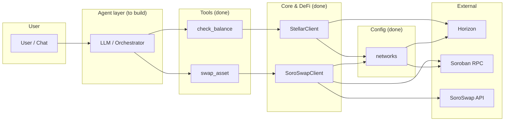
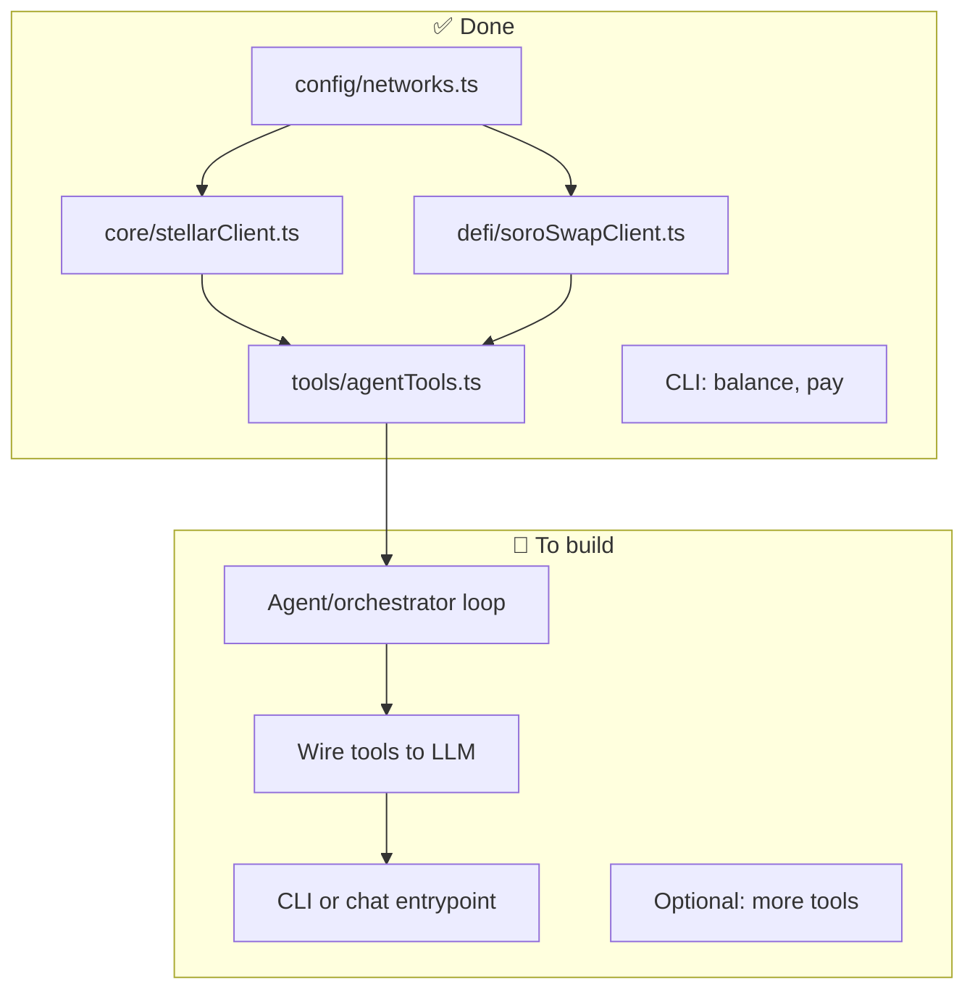
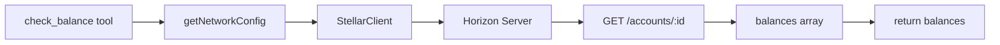
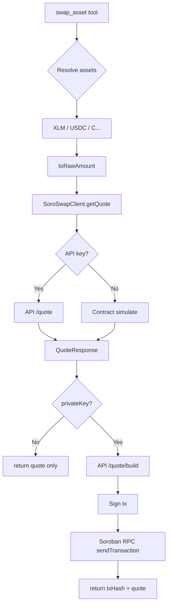
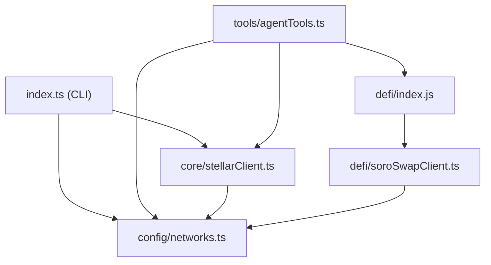

# Stellar DeFi Agent Kit — Flowchart & Progress

High-level plan and current progress for the hackathon agent kit.

---

## 1. Overall architecture (target)

---

## 2. Progress: what’s done vs what’s next

---

## 3. check_balance flow (current)

---

## 4. swap_asset flow (current)

---

## 5. Module dependency map

---

## 6. Legend

| Symbol | Meaning |
|--------|--------|
| ✅ Done | Implemented and in repo |
| 🔲 To build | Planned next steps |
| Agent layer | LLM/orchestrator that chooses and calls tools |
| Tools | LLM-ready functions (name, description, parameters, execute) |

---

## 7. Suggested next steps (order)

1. **Agent loop** — Prompt + LLM call + parse tool choice + call `tools[].execute` with parsed params.
2. **Wire to LLM** — Map `tools` to your provider’s tool format (e.g. OpenAI function calling / structured outputs).
3. **Entrypoint** — CLI command (e.g. `agent "swap 10 XLM to USDC"`) or simple chat server that runs the loop.
4. **Optional** — More tools (e.g. `send_payment` wrapping `StellarClient.sendPayment`), tests, README update for agent usage.
